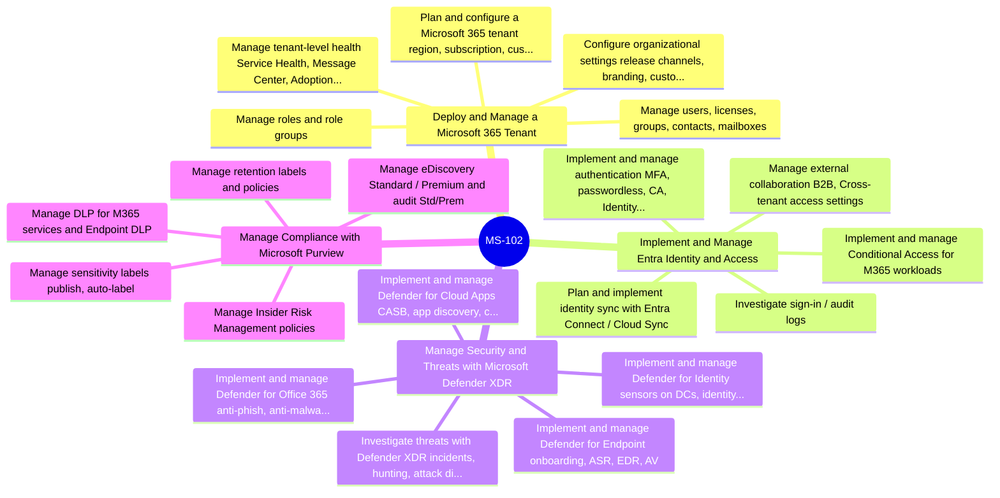
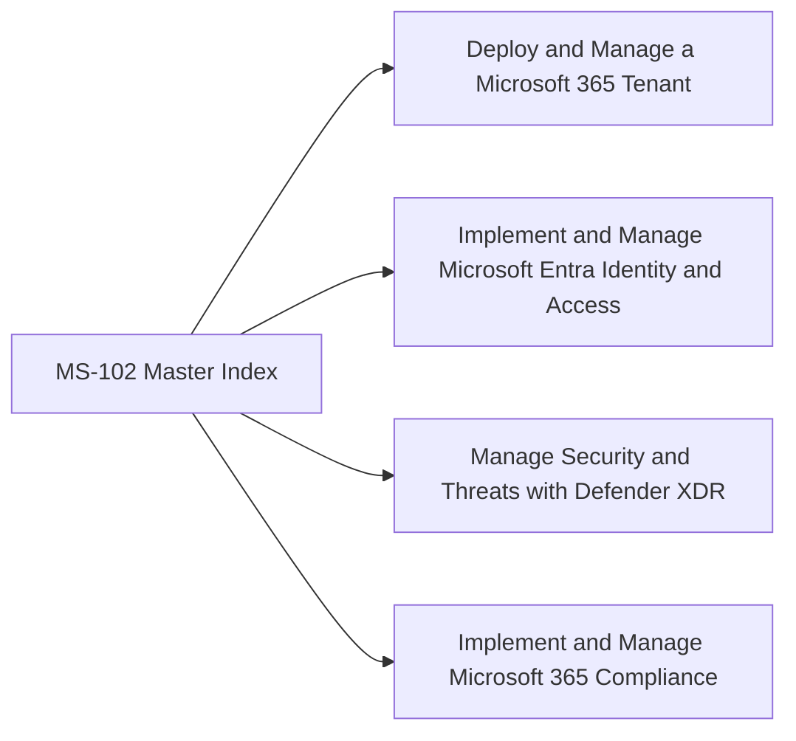
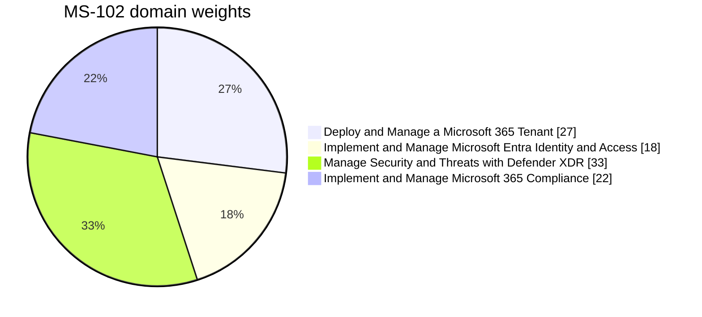

# MS-102 - Microsoft 365 Administrator - Visual Study Guide

> Concept-only study aid. No exam questions reproduced. Source PDF (if any) stays local + gitignored.

**Skills outline:** https://learn.microsoft.com/en-us/credentials/certifications/exams/ms-102/

## Master mind map

## Domain map

## Domain weights

> Click a slice / legend label to jump to that chapter.

## Recommended study order

```mermaid
gantt
    title Suggested study plan
    dateFormat X
    axisFormat Day %d
    section Plan
    Deploy and Manage a Microsoft 365 Tenant :t1, 0, 2d
    Implement and Manage Microsoft Entra Identity and Access :t2, after t1, 2d
    Manage Security and Threats with Defender XDR :t3, after t2, 2d
    Implement and Manage Microsoft 365 Compliance :t4, after t3, 2d
```

---

**Next:** open [01-m365-tenant.md](01-m365-tenant.md)

<!-- TODO: fill remaining sections via Copilot chat. Target structure mirrors c:\az305\study-guide\00-MASTER-INDEX.md. -->
