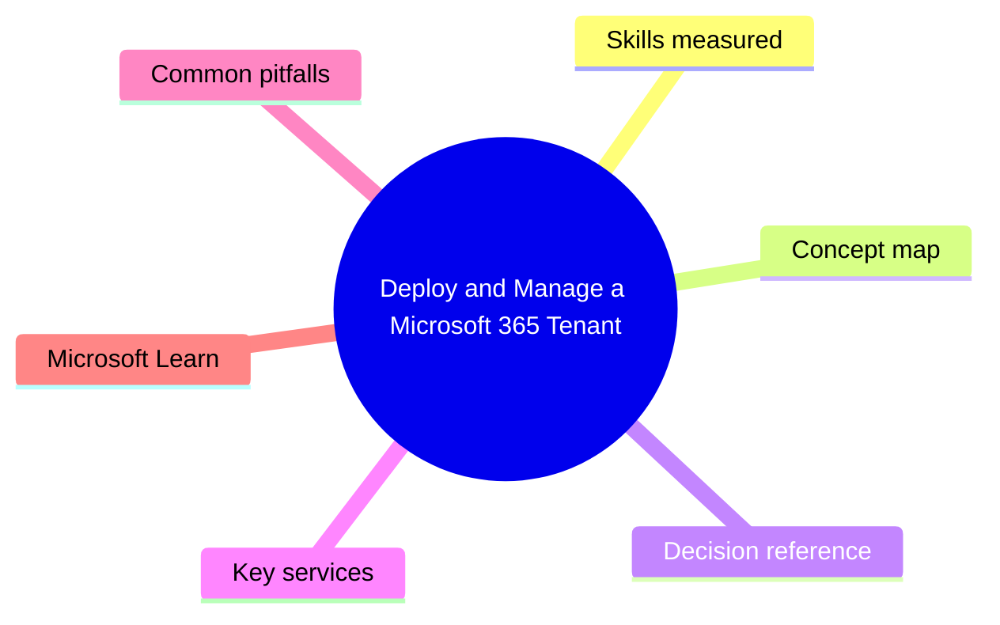
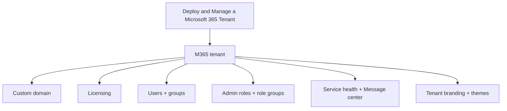

# Deploy and Manage a Microsoft 365 Tenant

> Domain 1 of MS-102. Weight: 27%.

## Domain mind map

## Skills measured

- Plan and configure a Microsoft 365 tenant (region, subscription, custom domain)
- Manage users, licenses, groups, contacts, mailboxes
- Manage roles and role groups
- Configure organizational settings (release channels, branding, custom themes)
- Manage tenant-level health (Service Health, Message Center, Adoption Score)

## Concept map

## Decision reference

| When you see... | Pick... | Why |
|---|---|---|
| Auto-license users by group | Group-based licensing | Assign license to group |
| Limit license to specific service | Disable plan within license | Per-user or per-group |
| Delegate Exchange admin only | Assign Exchange Administrator role | Granular role |
| Notify changes to tenant features | Subscribe to Message Center digest | Email digest |
| Verify tenant problem | Microsoft 365 Service Health portal | Live status |

## Key services

- **M365 admin center** - Tenant + user mgmt
- **Group-based licensing** - Auto-license
- **Service Health** - Tenant uptime status
- **Message Center** - Change announcements
- **Adoption Score** - Usage analytics

## Common pitfalls

- Adding custom domain without TXT verification (cannot use)
- Forgetting that Global Admin should be limited - use scoped admin roles
- Direct license assignment fights group-based licensing (causes errors)
- Setting wrong release channel for production (Targeted Release on prod = bleeding edge)

## Microsoft Learn

- [Deploy and manage a Microsoft 365 tenant](https://learn.microsoft.com/training/paths/m365-tenant/)

---

[<- Master Index](00-MASTER-INDEX.md) | [Master Index](00-MASTER-INDEX.md) | [Implement and Manage Entra Identity and Access ->](02-entra-identity.md)
