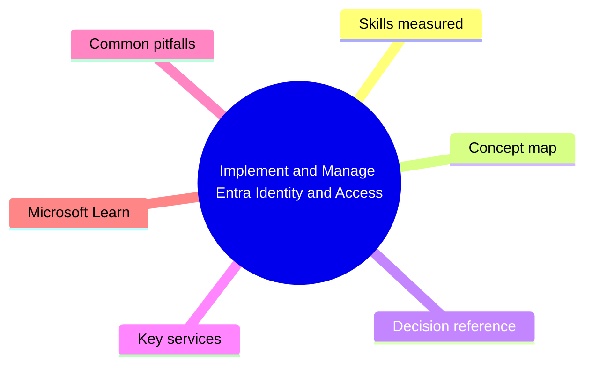
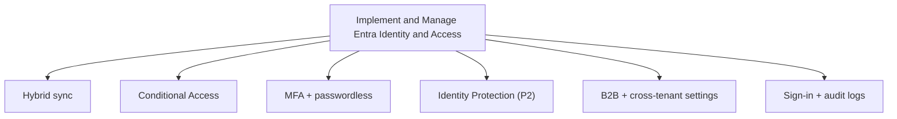

# Implement and Manage Entra Identity and Access

> Domain 2 of MS-102. Weight: 18%.

## Domain mind map

## Skills measured

- Plan and implement identity sync with Entra Connect / Cloud Sync
- Manage external collaboration (B2B, Cross-tenant access settings)
- Implement and manage authentication (MFA, passwordless, CA, Identity Protection)
- Implement and manage Conditional Access for M365 workloads
- Investigate sign-in / audit logs

## Concept map

## Decision reference

| When you see... | Pick... | Why |
|---|---|---|
| Block legacy auth | CA policy on legacy clients | Most impactful |
| Recommend default hybrid auth | PHS (Password Hash Sync) | Cloud-only sign-in |
| Enforce MFA for guest access | CA policy targeting guest users | External users separate |
| Detect risky sign-ins | Identity Protection sign-in risk policy | Requires P2 |
| Trust partner MFA | Cross-tenant access settings -> trust MFA + device claims | Avoid double MFA |

## Key services

- **Entra ID P1/P2** - License tier
- **Entra Connect / Cloud Sync** - Hybrid sync
- **Conditional Access** - Policy engine
- **Identity Protection** - Risk-based
- **CTAS** - Cross-tenant access settings

## Common pitfalls

- Federation by default (PHS is recommended)
- Forgetting break-glass exclusion in CA
- Not configuring CTAS - over-trusting external tenants

## Microsoft Learn

- [Manage Entra identity in M365](https://learn.microsoft.com/training/paths/m365-implement-identity-management/)

---

[<- Deploy and Manage a Microsoft 365 Tenant](01-m365-tenant.md) | [Master Index](00-MASTER-INDEX.md) | [Manage Security and Threats with Microsoft Defender XDR ->](03-defender-xdr.md)
