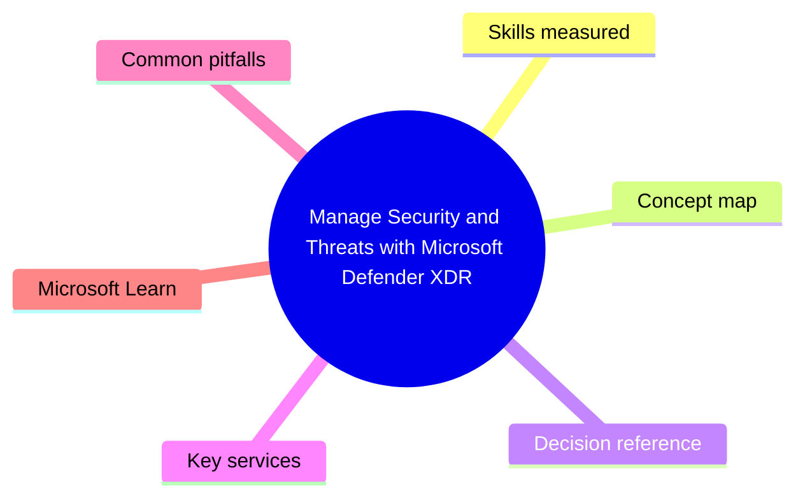
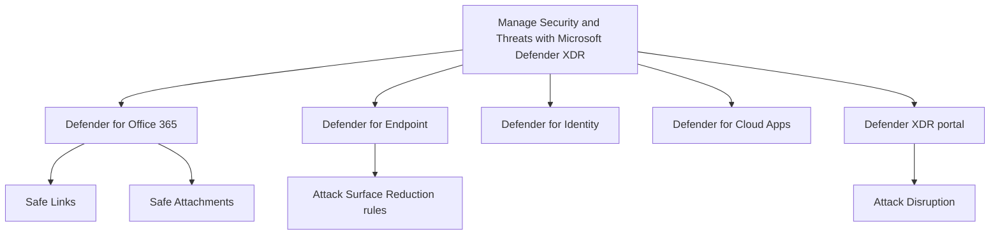

# Manage Security and Threats with Microsoft Defender XDR

> Domain 3 of MS-102. Weight: 33%.

## Domain mind map

## Skills measured

- Implement and manage Defender for Office 365 (anti-phish, anti-malware, ATP, Safe Links/Attachments)
- Implement and manage Defender for Endpoint (onboarding, ASR, EDR, AV)
- Implement and manage Defender for Identity (sensors on DCs, identity alerts)
- Implement and manage Defender for Cloud Apps (CASB, app discovery, conditional access app control)
- Investigate threats with Defender XDR (incidents, hunting, attack disruption)

## Concept map

## Decision reference

| When you see... | Pick... | Why |
|---|---|---|
| Detonate suspicious attachments | Safe Attachments (DfO Plan 1) | Sandbox detonation |
| Time-of-click URL check | Safe Links (DfO Plan 1) | Rewrites URLs |
| Reduce ransomware risk on devices | Enable ASR rules (block credential theft, Office child process, etc.) | GPO/Intune deploy |
| Detect AD recon (BloodHound, etc.) | Defender for Identity sensor on DCs | UEBA on AD |
| Discover shadow IT SaaS | DfCA cloud discovery (FW logs) | Catalog 30K+ apps |
| Auto-isolate compromised user | Defender XDR Attack Disruption (BEC/HumOpRansomware) | Native |

## Key services

- **Defender for Office 365 (P1/P2)** - Email + collab threats
- **Defender for Endpoint (P1/P2)** - EDR + AV
- **Defender for Identity** - On-prem AD UEBA
- **Defender for Cloud Apps** - CASB
- **Defender XDR** - Cross-workload SecOps
- **Attack Disruption** - Auto-containment

## Common pitfalls

- Confusing DfO Plan 1 (Safe Links/Attachments) vs Plan 2 (AIR + Threat Trackers)
- Onboarding to MDE without selecting onboarding method (GPO/Intune/script) consistently
- Forgetting ASR rules need audit-then-block rollout
- Not enabling DfI sensor on every DC (gaps)

## Microsoft Learn

- [Manage threats with Defender XDR](https://learn.microsoft.com/training/paths/m365-manage-threats-defender/)

---

[<- Implement and Manage Entra Identity and Access](02-entra-identity.md) | [Master Index](00-MASTER-INDEX.md) | [Manage Compliance with Microsoft Purview ->](04-m365-compliance.md)
