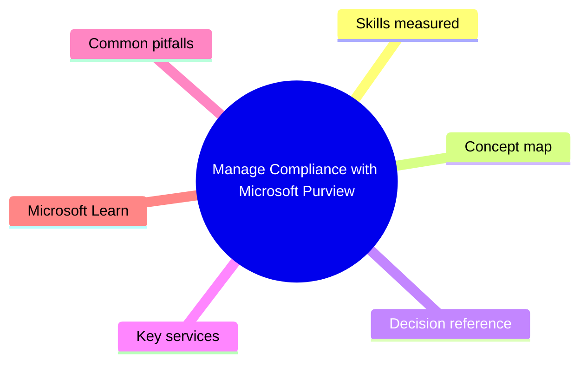
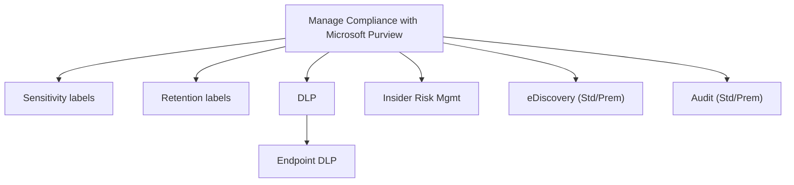

# Manage Compliance with Microsoft Purview

> Domain 4 of MS-102. Weight: 22%.

## Domain mind map

## Skills measured

- Manage sensitivity labels (publish, auto-label)
- Manage retention labels and policies
- Manage DLP for M365 services and Endpoint DLP
- Manage Insider Risk Management policies
- Manage eDiscovery (Standard / Premium) and audit (Std/Prem)

## Concept map

## Decision reference

| When you see... | Pick... | Why |
|---|---|---|
| Auto-encrypt confidential emails | Sensitivity label with encryption + auto-labeling policy | Service-side |
| Keep email 7 yrs auto-delete | Retention policy in DLM | Tenant-wide |
| Block USB upload of sensitive files | Endpoint DLP block rule | Device must be MDE-onboarded |
| Detect departing-user data theft | IRM 'Data theft by departing users' | HR connector |
| Litigation hold + ML review | eDiscovery Premium | Custodians + review sets |
| 10-yr audit retention | Audit Premium + 10-yr add-on | Crucial events |

## Key services

- **Microsoft Purview** - Compliance umbrella
- **Sensitivity labels** - Protect
- **Retention** - Lifecycle
- **DLP** - Service + endpoint + SaaS
- **IRM** - Behavioral risk
- **eDiscovery** - Legal discovery
- **Audit** - Tenant logging

## Common pitfalls

- Not running DLP in Test mode before Block
- Confusing sensitivity vs retention labels
- IRM without anonymization (privacy)
- Not licensing Audit Premium (only 180-day Standard retention)

## Microsoft Learn

- [Implement compliance in M365](https://learn.microsoft.com/training/paths/m365-compliance-information/)

---

[<- Manage Security and Threats with Microsoft Defender XDR](03-defender-xdr.md) | [Master Index](00-MASTER-INDEX.md) | [Cheatsheet ->](05-exam-cheatsheet.md)
