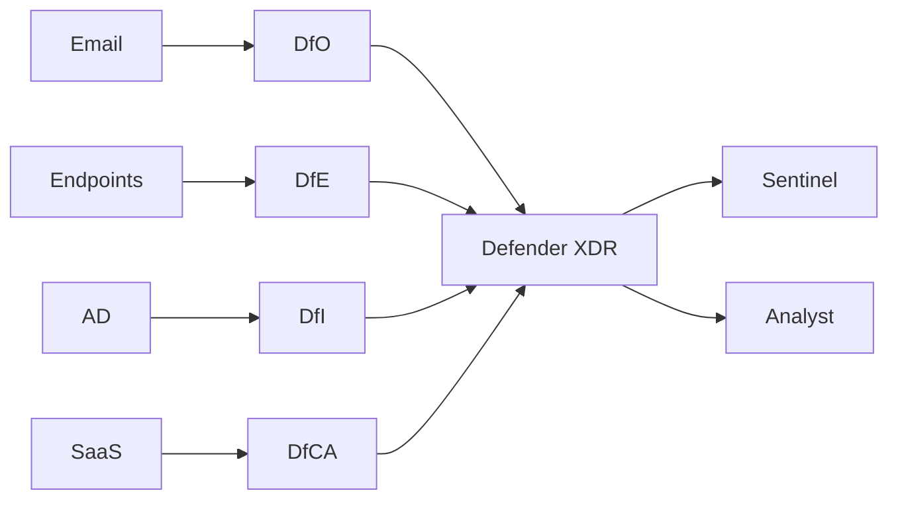
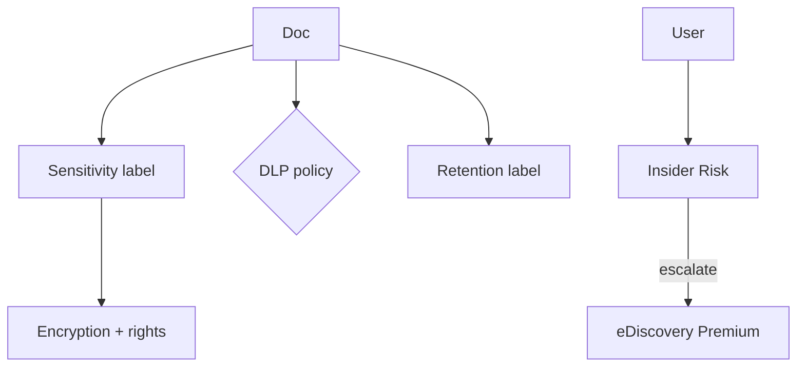

# Architectures - MS-102

> Reference architectures you should be able to draw on a whiteboard for the exam.

## M365 SecOps stack

```mermaid
flowchart LR
    Email --> DfO
    Endpoints --> DfE
    AD --> DfI
    SaaS --> DfCA
    DfO --> XDR[Defender XDR]
    DfE --> XDR
    DfI --> XDR
    DfCA --> XDR
    XDR --> Sentinel
    XDR --> SOC[Analyst]
```

## Compliance flow

```mermaid
flowchart TD
    Doc --> SL[Sensitivity label]
    SL --> Enc[Encryption + rights]
    Doc --> DLP{DLP policy}
    Doc --> RL[Retention label]
    User --> IRM[Insider Risk]
    IRM -->|escalate| ED[eDiscovery Premium]
```

---

[Master Index](00-MASTER-INDEX.md)
